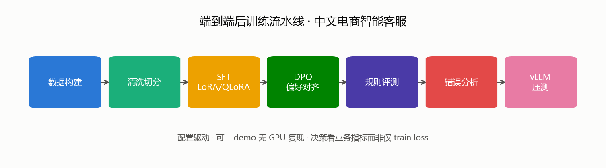
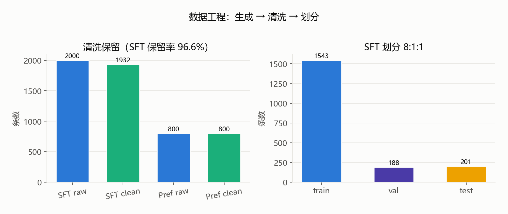
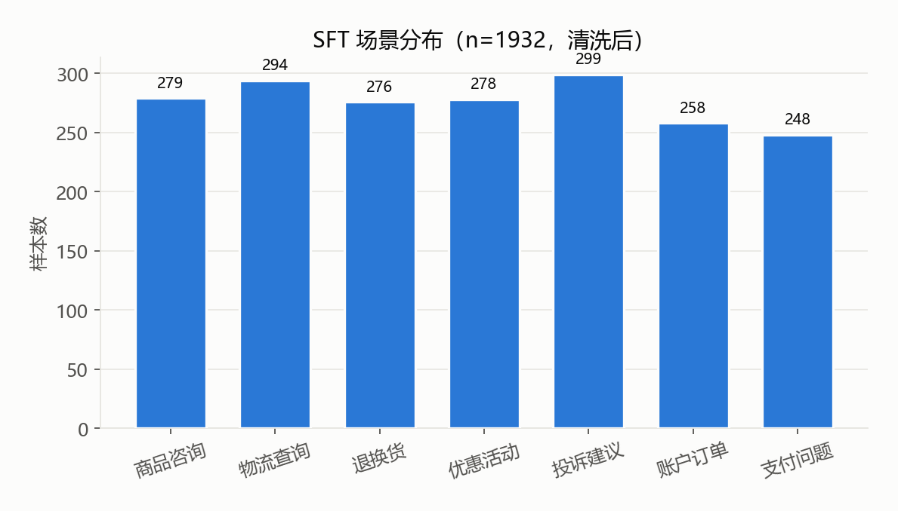
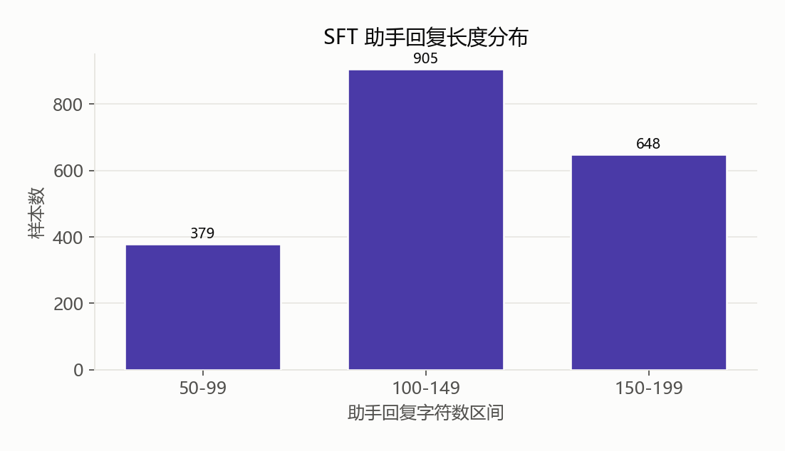
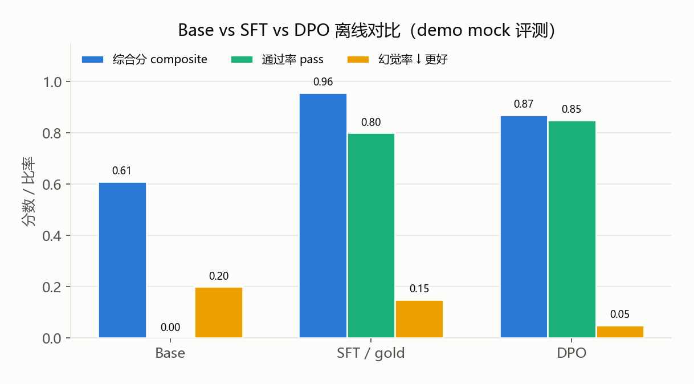
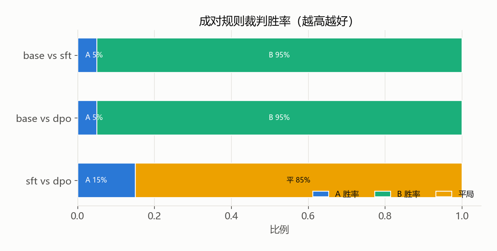
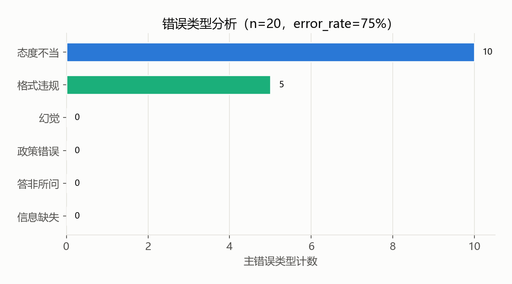
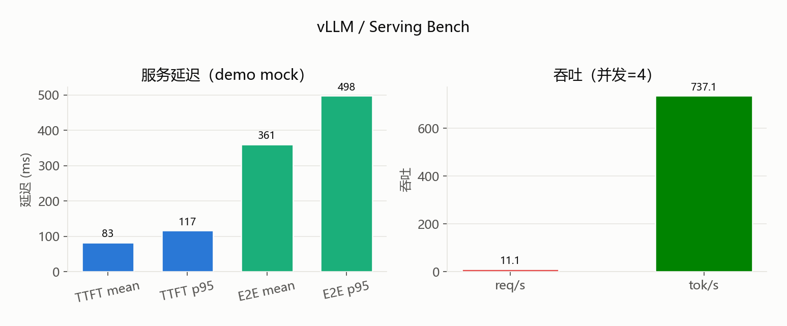
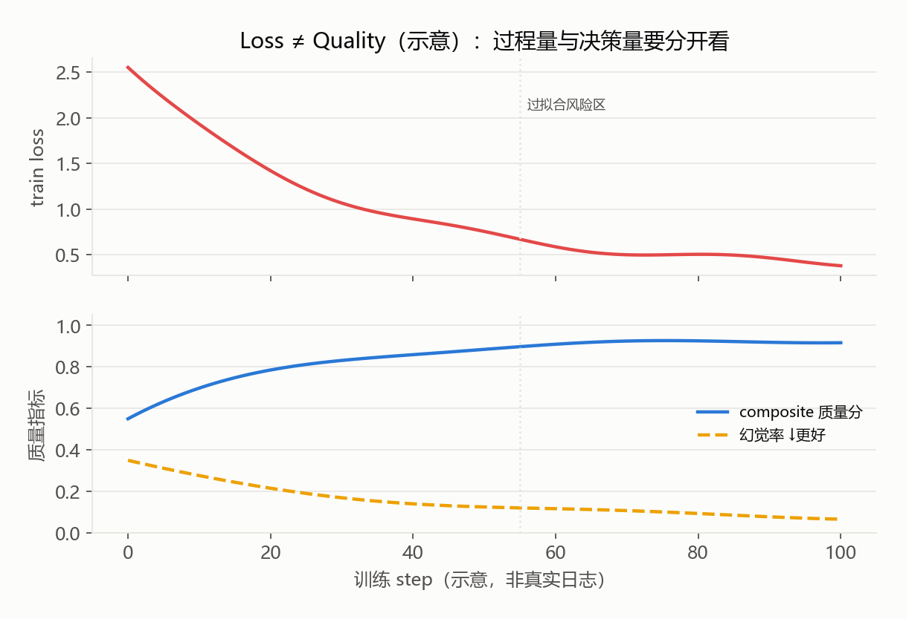

# LLM Post-Training Lab

**中文电商智能客服助手 · 端到端后训练实验工程**

[](LICENSE)
[](https://www.python.org/)
[](#quick-start)
[](https://github.com/chenzh659/llm-post-training-lab)

面向简历与工程实践的 **LLM Post-Training** 完整流水线：领域数据构建 → SFT → DPO → 规则评测 / 错误分析 → 推理部署与可复现报告。业务场景固定为 **中文电商智能客服助手**。

<p align="center">
  
</p>

> 目标不是堆 loss 曲线，而是产出可复现、可对比、可解释的 **业务指标 + 对齐指标 + 推理性能** 闭环。  
> **Loss ≠ Quality** — 详见 [`reports/FINAL_REPORT.md`](reports/FINAL_REPORT.md)。

---

## 项目目标

| 维度 | 说明 |
|------|------|
| **业务** | 中文电商客服：礼貌、准确、可行动；拒答越权与不编造单号/价格 |
| **训练** | SFT (LoRA/QLoRA) → DPO；配置驱动 |
| **评测** | 格式合规、关键词、幻觉、安全、胜率、错误 taxonomy — **不只看 train loss** |
| **工程** | 脚本一键、`--demo` 无 GPU 可跑、全量 GPU 可复现 |
| **简历** | 数据工程、对齐、评测体系、服务化与实验管理 |

---

## 推荐基座模型

| 场景 | 模型 |
|------|------|
| **Demo / CI** | `Qwen/Qwen2.5-0.5B-Instruct` |
| **质量更好** | `Qwen/Qwen2.5-1.5B-Instruct` |

---

## 结果速览（仓库内可复现 Demo 指标）

> 下图基于仓库中的合成数据与 `reports/*.json` 生成。全量 GPU 训练后请重跑  
> `python scripts/09_plot_reports.py` 覆盖图表。

### 数据工程

<p align="center">
  
</p>

| 数据集 | 生成 | 清洗后 | 保留率 | train / val / test |
|--------|-----:|-------:|-------:|--------------------|
| SFT | 2000 | 1932 | **96.6%** | 1543 / 188 / 201 |
| Preference | 800 | 800 | **100%** | 638 / 78 / 84 |

<p align="center">
  
</p>

<p align="center">
  
</p>

### 模型对比（规则评测）

<p align="center">
  
</p>

<p align="center">
  
</p>

### 错误类型 & 服务性能

<p align="center">
  
</p>

<p align="center">
  
</p>

### Loss ≠ Quality（方法论示意）

<p align="center">
  
</p>

上图为**教学示意曲线**（非真实 GPU 日志）：train loss 继续下降时，composite 与幻觉率仍需单独跟踪。决策以离线评测为准。

---

## 目录结构

```text
llm-post-training-lab/
├── configs/                 # data / sft / dpo / eval / deploy
├── data/
│   ├── raw/ · processed/ · splits/
│   └── examples/preview.jsonl
├── docs/assets/             # README 图表（PNG）
├── evaluation/              # metrics · zero_shot · compare · error_analysis
├── scripts/
│   ├── 01_build_data.py … 08_bench_serving.py
│   ├── 09_plot_reports.py   # 从 reports/*.json 生成图表
│   ├── run_pipeline.py
│   └── smoke_test.py
├── src/data · src/train · src/utils.py
├── reports/                 # 指标 JSON + FINAL_REPORT.md
├── requirements.txt
├── Makefile
├── LICENSE                  # Apache-2.0
└── README.md
```

---

## 流水线 Stages 1–10

| Stage | 名称 | 入口 |
|------:|------|------|
| 1 | 环境与冒烟 | `python scripts/smoke_test.py` |
| 2–3 | 数据构建 / 清洗切分 | `python scripts/01_build_data.py` |
| 4 | SFT | `python scripts/02_sft_train.py`（或 `--demo`） |
| 5–6 | 偏好 + DPO | `01_build_data` + `03_dpo_train.py` |
| 7 | 离线评测 | `04_eval_zero_shot.py` / `05_eval_compare.py` |
| 8 | 错误分析 | `06_error_analysis.py` |
| 9 | 服务与压测 | `07_deploy_vllm.py` / `08_bench_serving.py` |
| 10 | 报告与图表 | `reports/FINAL_REPORT.md` · `09_plot_reports.py` |

一键：

```bash
python scripts/run_pipeline.py --stage all --demo
# stages: data | sft | dpo | eval | deploy | all
```

---

## 关键指标（不只看 Loss）

| 类别 | 指标 |
|------|------|
| 任务质量 | 关键词命中、composite score、pass rate |
| 相对质量 | Base/SFT/DPO 规则胜率 |
| 可靠性 | Hallucination rate（编造单号/价格） |
| 安全 | Safety pass / banned phrase |
| 结构化 | Format compliance |
| 服务 | TTFT、throughput、p95 latency |

---

## Quick Start

### 1. 环境

```bash
cd llm-post-training-lab
python -m venv .venv

# Windows Git Bash
source .venv/Scripts/activate
# Windows cmd: .venv\Scripts\activate
# Linux/macOS: source .venv/bin/activate

pip install -r requirements.txt
# 生成 README 图表至少需要: pip install matplotlib pyyaml
```

### 2. 冒烟（无模型下载）

```bash
python scripts/smoke_test.py
# 或: make smoke
```

### 3. Demo 全流程（CPU OK）

```bash
python scripts/run_pipeline.py --stage all --demo
python scripts/09_plot_reports.py   # 刷新 docs/assets/*.png
```

### 4. 分阶段

```bash
python scripts/run_pipeline.py --stage data --demo
python scripts/run_pipeline.py --stage sft --demo
python scripts/run_pipeline.py --stage dpo --demo
python scripts/run_pipeline.py --stage eval --demo
python scripts/run_pipeline.py --stage deploy --demo
```

### 5. 完整 GPU 路径

```bash
python scripts/01_build_data.py --config configs/data.yaml
python scripts/02_sft_train.py --config configs/sft.yaml
python scripts/03_dpo_train.py --config configs/dpo.yaml
python scripts/04_eval_zero_shot.py --model outputs/sft
python scripts/05_eval_compare.py --base Qwen/Qwen2.5-0.5B-Instruct --sft outputs/sft --dpo outputs/dpo
python scripts/06_error_analysis.py --from-zero-shot reports/zero_shot_results.json
python scripts/07_deploy_vllm.py --config configs/deploy.yaml
python scripts/08_bench_serving.py --config configs/deploy.yaml
python scripts/09_plot_reports.py
```

---

## 样例数据预览

见 [`data/examples/preview.jsonl`](data/examples/preview.jsonl)（5 条客服对话，`messages` 格式）。

```text
用户: 物流怎么还没更新？
助手: 请提供订单号，或在订单详情页查看轨迹；多日未动可协助催查……
```

---

## 图表如何再生

```bash
pip install matplotlib
python scripts/09_plot_reports.py
# 输出: docs/assets/*.png
```

| 文件 | 含义 |
|------|------|
| `pipeline.png` | 端到端流水线 |
| `data_pipeline_stats.png` | 清洗保留 + 划分 |
| `category_distribution.png` | SFT 场景分布 |
| `length_histogram.png` | 回复长度直方图 |
| `model_comparison.png` | Base / SFT / DPO 指标 |
| `win_rates.png` | 规则裁判胜率 |
| `error_taxonomy.png` | 错误类型 |
| `serving_bench.png` | TTFT / p95 / 吞吐 |
| `loss_vs_quality.png` | Loss ≠ Quality 示意 |

---

## 如何复现

1. 固定 `requirements.txt` 与 Python ≥ 3.10  
2. 配置中 `seed: 42`  
3. 记录 `data/splits/split_summary.json` 与 `reports/*`  
4. Demo 命令与 GPU 命令分开写在实验笔记中  

最小 Checklist：

```text
[ ] venv + pip install -r requirements.txt
[ ] python scripts/smoke_test.py          → 全 PASS
[ ] python scripts/run_pipeline.py --stage all --demo
[ ] python scripts/09_plot_reports.py
[ ] 打开 reports/FINAL_REPORT.md 与 docs/assets/
```

---

## License

**Apache License 2.0** — 见 [`LICENSE`](LICENSE)。

模型权重（如 Qwen2.5）遵循各自模型许可证。

---

## 免责声明

合成/示例数据不代表真实用户隐私；上线前需合规数据、人工审核与风控。  
Serving 与部分对比图中的 demo mock 数值请以 GPU 真实验为准。
